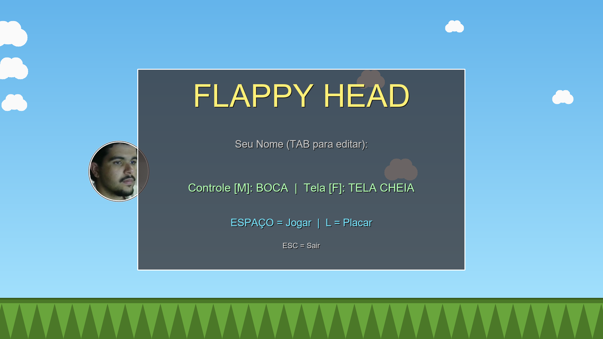
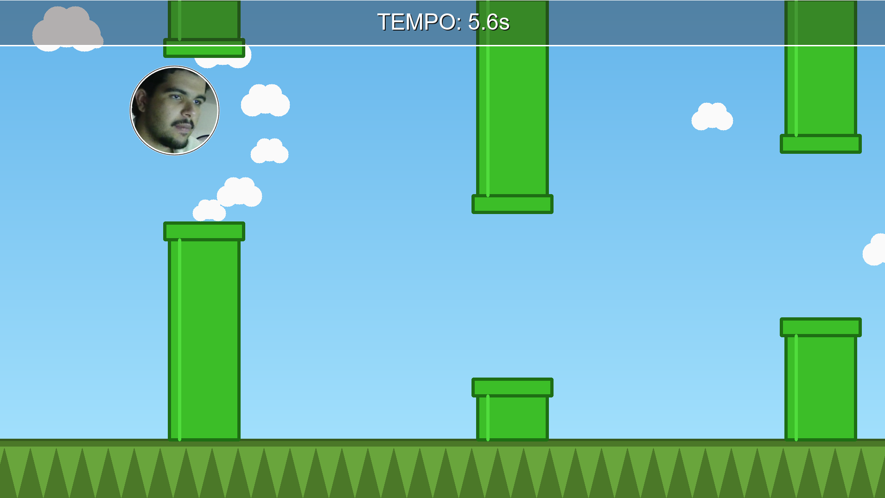
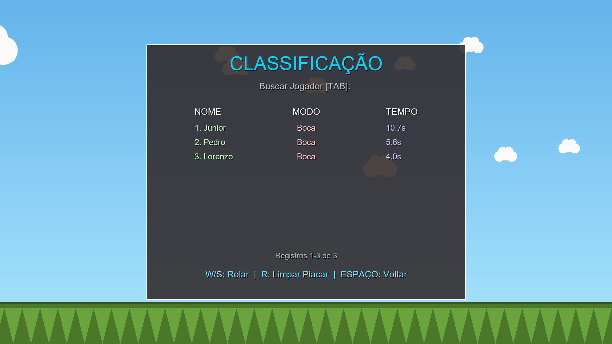

# Flappy Head

[](https://github.com/junin27/Flappy-Head/actions/workflows/tests.yml)
[](https://www.python.org/)
[](https://opensource.org/licenses/MIT)

**Flappy Head** is an adaptation and direct clone of the popular game **Flappy Bird**, recreating its classic mechanics of dodging vertical obstacles. 

The main **distinction** and innovation of **Flappy Head** lies in its interactive control scheme: instead of using mouse clicks or screen taps, the player uses **their own face** (via a camera) captured in real-time! Leveraging Computer Vision and Artificial Intelligence, the game offers two unique control modes:
1. **MOUTH Mode:** Opening your mouth makes the character flap upwards (replacing screen taps).
2. **HEAD Mode:** Tilting your head up or down smoothly guides the player's altitude.

Additionally, unlike the classic game, Flappy Head features smart detection for camera disconnection or face loss (displaying safety alerts directly on the screen) and a dynamic difficulty system that progressively speeds up the game based on survival time.

The project is built in Python, using **OpenCV** for graphic rendering (without relying on complex game engines) and Google's **MediaPipe** for high-precision, high-performance facial *landmarks* detection (virtual coordinates mapped in real-time to specific areas of the face like eyes, nose, and mouth to track movement and expressions).

---

### 🏛️ Academic Presentation

This project was presented in the Software Engineering course during [Conexão UniRV](https://www.unirv.edu.br/ver_noticias.php?codabr=20226), one of the largest university extension programs of the [Universidade de Rio Verde](https://www.unirv.edu.br/). 

The event's main goal is to bring the University closer to the local community, fostering knowledge exchange through free services, educational, recreational, and cultural activities. In the engineering and technology track, **Flappy Head** was presented as a practical and interactive demonstration of how complex Artificial Intelligence and Computer Vision concepts can be applied to build games and accessible software for the general public.

---

## 🎮 Features

- **Computer Vision Controls**:
  - **MOUTH Mode:** Open your mouth to flap upwards. Close it to let gravity pull you down.
  - **HEAD Mode:** Tilt your head back (raising your nose) to go up, and tilt it forward (lowering your chin) to go down. Keep it centered to hover.
- **Dynamic Camera/Face Alerts:** The game automatically detects whether a camera is available for use or if your face left the tracking area, displaying visual warnings ("CAMERA NOT DETECTED" or "FACE NOT DETECTED") directly on the player's sphere.
- **Progressive Difficulty:** Every 20 seconds of survival, the difficulty increases automatically. Obstacles spawn faster and move quicker, demanding sharper reflexes by the second!
- **Local Leaderboard:** Supports typing username with scores persisted in a local CSV database.

---

## 📸 Visual Showcase

Below are some screenshots demonstrating the visual style and features of **Flappy Head:**

| Main Screen (Menu) | Match (Camera Overlay) | High Scores (Leaderboard) |
| :-: | :-: | :-: |
|  |  |  |

---

## 🛠️ Installation Step-by-Step

Follow the steps below to set up and run the project locally.

### 1. Prerequisites
- **Python 3.9 or higher** installed.
- A functional and well-lit **webcam**.

### 2. Setting Up the Virtual Environment (Recommended)
It is best practice to run Python projects within an isolated virtual environment (venv). Open your terminal in the project directory and run:

**On Windows:**
```powershell
# Create the virtual environment named "venv"
python -m venv venv

# Activate the virtual environment
.\venv\Scripts\activate
```

**On Linux / macOS:**
```bash
python3 -m venv venv
source venv/bin/activate
```

### 3. Installing Dependencies
With the environment activated, install the required libraries listed in `requirements.txt`:

```bash
pip install -r requirements.txt
```
*(Dependencies include stable versions of `opencv-python`, `mediapipe`, and `numpy`)*

### 4. Running the Game
Simply run the main entry point file. On the first run, the game will automatically download the MediaPipe AI model file (~3.7MB).

```bash
python flappy_head.py
```

---

## 🕹️ Controls (Key Bindings)

| Key / Action | Context | Description |
| :--- | :--- | :--- |
| **SPACEBAR** | Main Menu | Starts the game in the selected control mode |
| **SPACEBAR** | Game Over / Leaderboard | Returns to the Main Menu |
| **TAB** | Main Menu / Leaderboard | Toggles the input text field (Name entry or Search) |
| **M** | Main Menu | Toggles the gameplay control mode (**MOUTH** vs. **HEAD**) |
| **L** | Main Menu | Opens the Leaderboard screen |
| **F** | Global | Toggles display mode (**Windowed**, **Fullscreen**, or **Borderless**) |
| **W** or **Up Arrow** | Leaderboard Screen | Scrolls up the high scores list |
| **S** or **Down Arrow**| Leaderboard Screen | Scrolls down the high scores list |
| **R** | Leaderboard Screen | Clears all leaderboard data |
| **ESC** | Global | Exits and closes the game |

---

## 📐 Engineering Guidelines and Best Practices

The project was architected under strict **Extreme Programming (XP)** discipline, adhering to professional software engineering standards and **Clean Code:**

- **TDD (Test-Driven Development) & FIRST:** Every physical, logical, or persistence component is backed by fast, independent, repeatable, self-validating, and timely unit tests. No logic was implemented without its respective specification test.
- **Strict Mandatory Typing (Type Hints):** 100% of functions, parameters, returns, and attributes use explicit Python *Type Hints*. Weak or generic types (such as generic `Any` or `dict`) were banned to ensure codebase robustness.
- **Modularity and SRP (Single Responsibility Principle):** 
  - **Short Functions:** All functions consist of 4 to 20 lines of functional code, executing exactly one clear responsibility.
  - **Cohesive Files:** Modules are kept under 300 lines of code to prevent code bloat and promote high maintainability.
- **Reduced Nesting (Early Returns):** The execution flow favors *early returns* to lower cognitive complexity, keeping logical nesting to a maximum of 2 levels.
- **Zero Code Duplication (DRY):** Shared abstractions were extracted instead of duplicating code blocks.
- **Dependency Injection:** I/O handlers, CSV persistence, and camera capture threads are injected directly through constructors, facilitating clean mocking and isolated test runs.
- **Decision Comments (The "Why"):** Internal documentation focuses on justifying design choices and the physics calculations (gravity/bounding boxes), leaving the clean code syntax to explain the "what".
- **Structured Logging:** Centralized use of Python's standard `logging` module instead of quick `print` calls, segregated by severity levels and routed properly.

### Module Structure:
- `src/main.py`: Central orchestrator and Game Loop.
- `src/config.py`: Configuration constants and visual/physical calibration parameters.
- `src/engine/`: Modular physics engine, mathematical collision, and difficulty progression.
- `src/models/`: Strongly typed data models (`Player`, `Pipe`).
- `src/vision/`: Async thread for latency-free webcam frames capturing and integration with MediaPipe's FaceLandmarker.
- `src/ui/`: Responsible solely for the OpenCV graphics rendering engine and HUD screens.
- `src/data/`: Persistence repository handling local CSV high scores database.

---

## 🧪 Test Suite and Continuous Integration (CI)

The repository is integrated with **GitHub Actions** to continuously validate the integrity of new commits.

### Running Unit Tests Locally:
```bash
python -m unittest discover tests
```

### CI Setup (.github/workflows/tests.yml):
On every push or pull request, **25 unit tests** run automatically under a test matrix spanning **Python 3.9, 3.10, and 3.11** on isolated environments (Ubuntu Linux). This ensures the reliability of the physics engine, database persistence, and keyboard/UI inputs.
